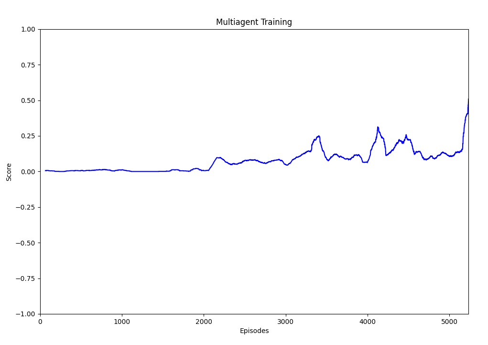

## Project Collaboration and Competition - Report

### Multi-Agent Deep Deterministic Policy Gradient (MA-DDPG)

The problem was solved with a multi-agent version of DDPG which is an Actor-Critic method that is similar to DQN for continuous actions. 
The main idea is to use an Actor network to predict actions in the continuous space. The value function is estimated by a different network called the Critic.

In order to avoid temporal correlation between sampled states, we use a replay buffer from which we sample batches of experiences randomly. Another advantage of the replay buffer is the ability to reuse the experience multiple times.
During training, we encourage exploration by using an epsilon-greedy policy for action selection.
Also, to make learning more stable we separate the evaluation network from the selection network for both the Actor and the Critic. We use soft updates to update the target network continuously.

To support the multi-agent environment, we train a shared actor-critic with a shared replay buffer.
Which means that we use the same actor to compute actions for both agents, then add the collected experiences to the same replay buffer,
then we do batch training by sampling from that one buffer. It made it easier to implement and also it is a kind of learning through self play
as both agents are making actions using the same policy being learnt.

### Network Architecture

As the actor and critic are separated, we can use different architectures, but for keeping things simple for this project we use the same architecture for both actor and critic, except that for the actor we use a tanh activation to get values between -1 and 1.
We also use **relu** activation for the hidden layers to introduce non-linearity.

We use a deep network for both actor and critic with two hidden layers:

Input size: 24, same as state size
First layer: fully connected of size 256, with relu activation
Second layer: fully connected of size 128, with relu activation
Output layer: fully connected of 2, same as action size (with tanh activation for Actor only)

### Hyper-parameters
The following hyper-parameters were used for training:

| Parameter | Value | Description |
| --------- | ----- | ----------- | 
| BUFFER_SIZE | 100000 | Maximum size of the replay buffer |
| BATCH_SIZE | 1024 | Size of the batch of experiences to sample from the buffer |
| LEARNING_RATE | 0.0001 | Learning rate for Actor and Critic optimizers |
| TAU | 0.001 | Coefficient for soft update of network weights |
| GAMMA | 0.99 | Future rewards discounting
| FC1_UNITS | 256 | Size of first fully connected layer |
| FC2_UNITS | 128 | Size of second fully connected layer |
| UPDATE_EVERY | 2 | Frequency for training, skipping similar consecutive states |
| EPS_INIT | 1.0 | Initial value for random exploration |
| EPS_DECAY | 0.9999 | Multiplicative decay
| EPS_MIN | 0.01 | Minimum value for random exploration |

### Results
We consider the problem solved when the agents reach an average score over +0.5 for the last 100 episodes.
The agent was able to solve the environment in 5233 episodes as shown in the following figure (plot of the running average of the last 100 episodes):

You can also see a recorded video of the trained agents playing the game:

[Youtube Video](https://youtu.be/60w8-_xzCuM)

### Ideas for improvement

It took a lot of episodes for the agents to start learning anything so probably more hyperparameters tuning could help there.
Also, the experiences are sampled randomly from the replay buffer, so better experience sampling like the Prioritized experience replay should help to improve that.
Another point, is to try different network architectures and different learning rates for the actor and critic models.
Basically, anything that improves learning the policy for continuous action spaces for the single agent case can be explored 
for this version of multi-agent environment, where we are using the same policy for both agents.